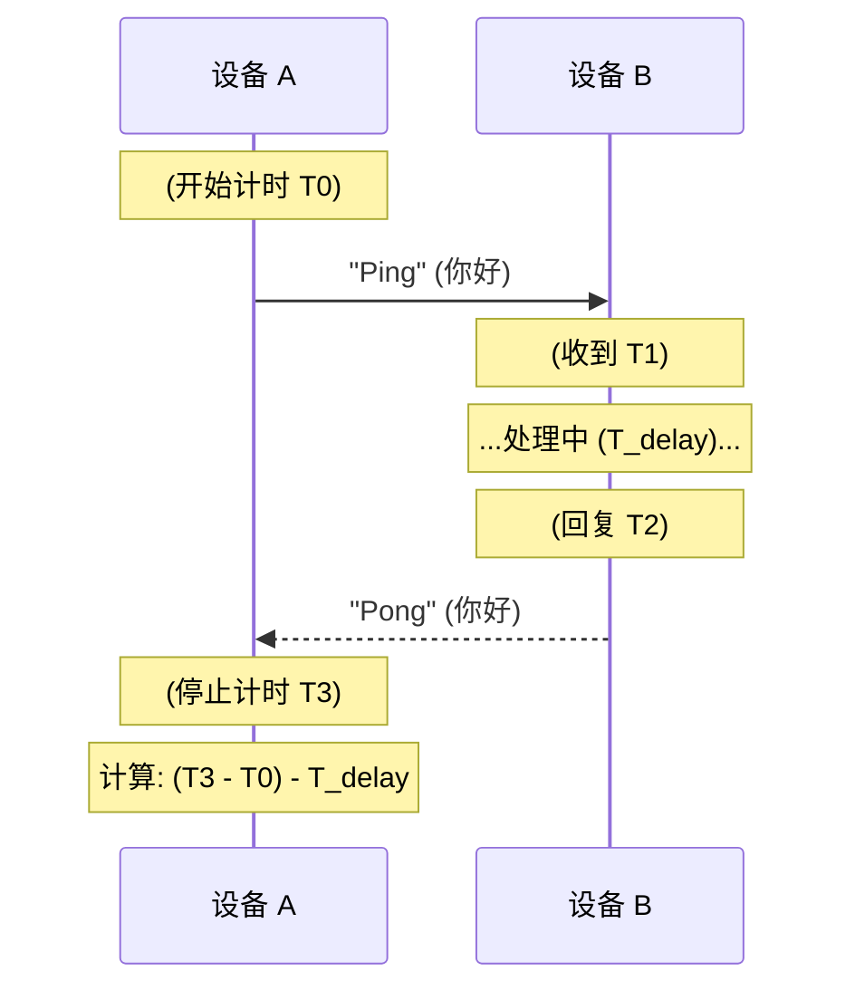
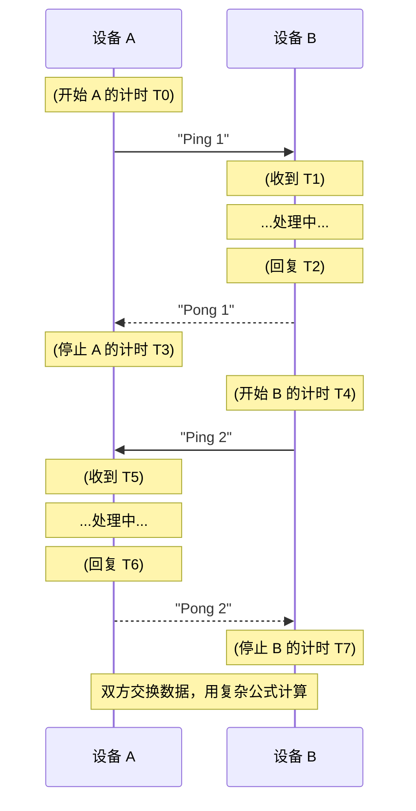

好的，我来用更简单的文本流程图来“画”出这两个过程，帮助您理解它们的核心区别。

-----

### 图 1: SS-TWR (单边双向测距)

这个过程**只有 A 在测量**，像是一个简单的“问”与“答”。

**简单小结:**

  * A 向 B 发送消息。
  * B 收到后，**等待一段时间 (T\_delay)**，然后回复。
  * A 测量总共花了多久。
  * **问题:** A 必须猜 B 的 "T\_delay"（处理时间）是多久，才能算出飞行时间。

-----

### 图 2: DS-TWR (双边双向测距)

这个过程**A 和 B 互相测量**，像是“你问我答”，然后“我问你答”。

**简单小结:**

  * **第1步 (A问B答):** A 测量它发出的 "Ping 1" 的往返时间。
  * **第2步 (B问A答):** B 测量它发出的 "Ping 2" 的往返时间。
  * **最后:** 两台设备交换它们各自测量的4个时间戳（A有 T0, T3；B有 T1, T2；B有 T4, T7；A有 T5, T6）。
  * **优势:** 通过这种对称的交换，它们可以用一个公式**同时消除**双方的处理延迟和时钟误差，不需要去“猜” T\_delay。

简单来说，**SS-TWR (图1) 是不精确的，因为它依赖猜测；DS-TWR (图2) 是精确的，因为它通过互相测量来消除猜测。**